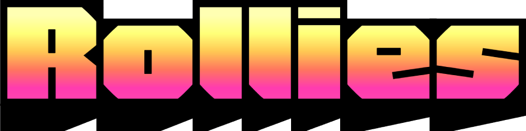

<h1 align="center">
	 
</h1>

Rollies is a dice rolling site and syntax interpreter made in Typescript. 

Based on the [Dice Parser](https://github.com/Rolisteam/DiceParser/blob/master/HelpMe.md) syntax, you can use it to roll dice, make simple calculations, and even create complex formulas.

The lexer, parser and evaluator are all written from scratch, based on the intepreter written by Thorsten Ball in his book [Writing an Interpreter in Go](https://interpreterbook.com/).

## Examples

- `2d6` - Roll two six-sided dice.
- `1d20+5` - Roll a twenty-sided die and add 5 to the result.
- `10d10kl5` - Roll ten ten-sided dice and keep the five lowest results.
- `3d6+2d8` - Roll three six-sided dice and two eight-sided dice, then add the results together.

## Operators
- `d` - Roll a die with the specified number of sides. Example: `2d6`.
- `k or kh` - Sort and keep the highest dice. Example: `10d10k5`.
- `kl` - Sort and keep the lowest dice. Example: `10d10kl5`.
- `s` - Sort the dice in descending order. Example: `10d10s`.
- `sl` - Sort the dice in ascending order. Example: `10d10sl`.
